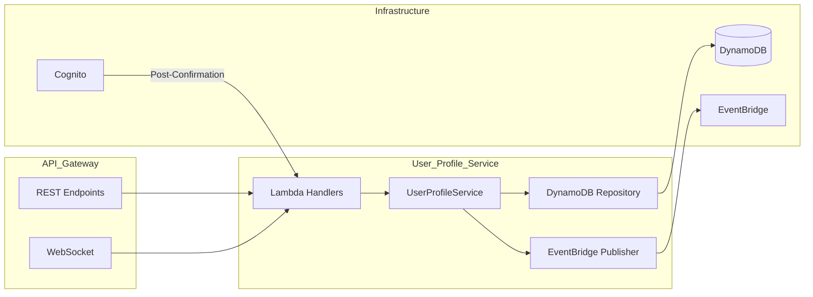

# User Profile Service

The User Profile Service manages user identity, preferences, savings goals, and real-time WebSocket connections. Built as a pure Serverless Python application, it leverages a Layered Architecture, AWS API Gateway, AWS Lambda, DynamoDB, and AWS Cognito.

## Key Features & Impacts
* **Identity Management:** Standardizes user identification via an internal UUID, decoupling the system from the external Cognito IdP and ensuring seamless future migrations.
* **Savings Goals & Preferences:** Manages personalized financial configurations and tracking targets, empowering users to monitor their "Safe to Spend" metrics.
* **Real-time Notifications:** Implements a WebSocket infrastructure that enables background workers (e.g., statement processors) to push instant, asynchronous updates to the client browser without polling overhead.
* **Automated Offboarding:** Orchestrates complete account deletion workflows by purging localized data and emitting integration events for downstream service cleanup.

## Architecture

This service strictly adheres to a Python Layered Architecture, decoupling API handlers, business logic, and database access.



**Project Structure:**
```text
app/
├── api/             # API Layer (REST and WebSocket Lambda handlers)
├── core/            # Global configuration & Dependency Injection container
├── crud/            # Data Access Layer (DynamoDB Repositories)
├── schemas/         # Pydantic models & Data Transfer Objects
└── services/        # Core Business Logic & EventBridge Publishers
```

## Tech Stack
Frontend:	Angular (via fintracker-ui)
Backend:	Python (Lambda Handlers)
Cloud:		AWS (Lambda, DynamoDB, Cognito, EventBridge, API Gateway)
DevOps:		Poetry, GitHub Actions

## Modules & Interfaces

**REST API Operations**
| Module | Method | Path | Description |
|---|---|---|---|
| Profile | `GET` | `/profile/settings` | Fetches the unified user profile and notification settings. |
| Profile | `DELETE` | `/profile` | Initiates the account offboarding workflow. |
| Goals | `GET` | `/profile/goals` | Lists all savings goals for the user. |
| Goals | `POST` | `/profile/goals` | Creates a new savings goal. |
| Goals | `DELETE` | `/profile/goals/{id}` | Deletes a specific savings goal. |

**Event-Driven / Serverless Triggers**
| Event Source | Trigger/Pattern | Description |
|---|---|---|
| AWS Cognito | Post-Confirmation | Fires after email confirmation to initialize the user's DynamoDB profile. |
| API Gateway | WebSocket `$connect` | Authorizes the user and stores their WebSocket connection ID. |
| API Gateway | WebSocket `$disconnect` | Cleans up the disconnected WebSocket session from DynamoDB. |

## Environment Variables
| Variable | Description |
|---|---|
| `DYNAMODB_TABLE_NAME` | Name of the DynamoDB table (Single Table Design) |
| `EVENT_BUS_NAME` | AWS EventBridge bus name for integration events |
| `POWERTOOLS_SERVICE_NAME` | Service name for logging/tracing |

## Core Workflows

* **Identity Mapping Initialization:** Upon Cognito's Post-Confirmation trigger, the service atomically writes an `IDENTITY` mapping alongside `PROFILE` and `SETTINGS` rows in DynamoDB.
* **Account Offboarding:** Account deletion requests trigger a BatchWrite to erase all DynamoDB rows associated with the user and emit a `UserAccountDeleted` event to EventBridge.

## Quick Start
<details>
<summary>Click to expand setup instructions</summary>

### Prerequisites
* Python 3.12+
* Poetry
* Docker & Docker Compose (for local DynamoDB)

### Installation
1.  **Clone the repository & navigate to the service:**
    ```bash
    git clone https://github.com/vanKvo/fintracker-user-profile.git
    cd fintracker-user-profile
    ```
2.  **Configure Environment:**
    Create a `.env` file with the required DynamoDB and EventBridge configurations.
3.  **Install Dependencies:**
    ```bash
    poetry install
    ```
4.  **Run Tests:**
    ```bash
    poetry run pytest
    ```

</details>
